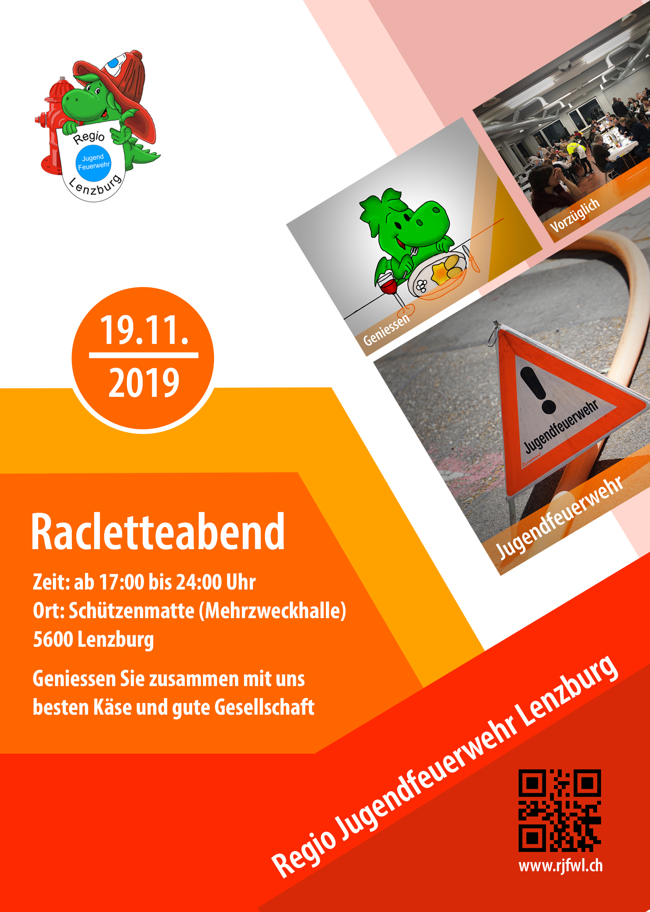

Klicke auch "Teilnehmen" bei unserem [EVENT auf Facebook](https://www.facebook.com/events/337517887088637/)

Folge uns auf [ Instagram](https://www.instagram.com/regiojugendfeuerwehrlenzburg/) und [ Facebook](https://www.facebook.com/RJFWL/)

 

## Anfahrtsplan zum Racletteabend

<iframe src="https://www.google.com/maps/embed?pb=!1m14!1m8!1m3!1d337.6296118851088!2d8.1839896!3d47.391713!3m2!1i1024!2i768!4f13.1!3m3!1m2!1s0x479016754a25cd7f%3A0xc449652c79663849!2sMehrzweckhalle%20Lenzburg!5e0!3m2!1sde!2sch!4v1568374707819!5m2!1sde!2sch" width="600" height="450" frameborder="0" style="border:0;" allowfullscreen=""></iframe>

 

## Was ist die Regio Jugendfeurwehr Lenzburg?

Wenn Feuer löschen, Feuerwehr-Gerätschaften bedienen, Erste Hilfe leisten und im Verkehrsdienst mithelfen dein Ding ist und du zwischen 10 und 18 Jahre alt bist, dann bist du bei uns genau richtig. Alle diese Themen werden bei uns im Übungsdienst bearbeitet. Dabei kommt auch das Gesellige und das Arbeiten im Team nie zu kurz. Wir freuen uns auf neue Gesichter.

 

### Unser Jahresprogramm und Organigramm findest du im 

 

Folge uns auf [ Instagram](https://www.instagram.com/regiojugendfeuerwehrlenzburg/) und [ Facebook](https://www.facebook.com/RJFWL/)
