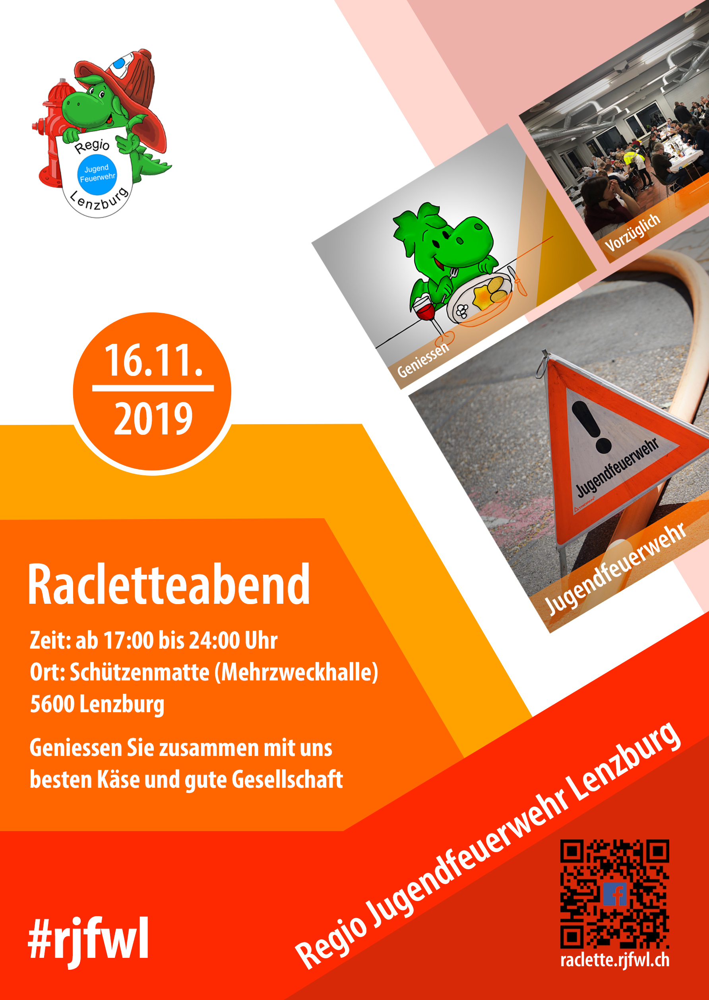
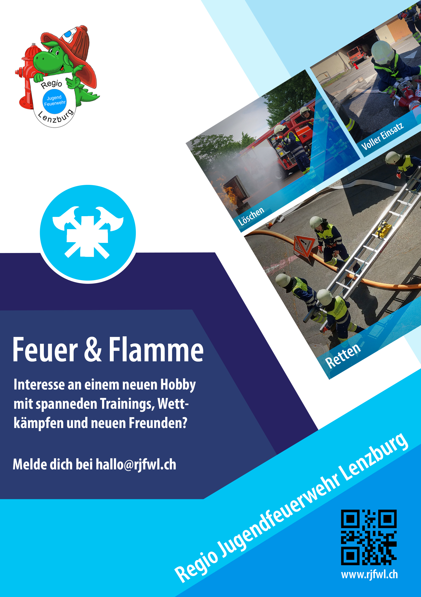

Klicke auf "Teilnehmen" bei unserem [EVENT auf  Facebook](https://www.facebook.com/events/337517887088637/)

# Geniessen Sie zusammen mit uns besten Käse und gute Gesellschaft

 

Die Regio Jugendfeuerwehr Lenzburg lädt zum diesjährigen Racletteabend in der Mehrzweckhalle Schützenmatte ein. 
Wir schmelzen für erstklassigen Käse, guten Wein und eine gesellige Atmosphäre. 
Die Angehörigen der Jugendfeuerwehr freuen sich darauf Sie zu bedienen.

 

- Gemütliche Atmosphäre für die ganze Familie am Racletteabend der Jugendfeuerwehr

- Geniessen Sie Raclette ohne den Geschmack in der Wohnung und den Abwasch danach

- Alle sind Willkommen!

- Fördern Sie die nachhaltige Jugendarbeit = Vorbereitung auf einen wertvollen Dienst an der Bevölkerung in Notlagen

- Unterstützen Sie Finanzierung der nachhaltigen Jugendarbeit - der Gewinn des Racletteabends fliesst vollumfänglich in den Verein Regio Jugendfeuerwehr Lenzburg, welcher für nachhaltige Jugendarbeit im Bereich Feuerwehr steht.

- Tombola mit Preisen aus der Region

## Anfahrtsplan zum Racletteabend

<iframe src="https://www.google.com/maps/embed?pb=!1m14!1m8!1m3!1d337.6296118851088!2d8.1839896!3d47.391713!3m2!1i1024!2i768!4f13.1!3m3!1m2!1s0x479016754a25cd7f%3A0xc449652c79663849!2sMehrzweckhalle%20Lenzburg!5e0!3m2!1sde!2sch!4v1568374707819!5m2!1sde!2sch" width="100%" height="450" frameborder="0" style="border:0;" allowfullscreen=""></iframe>

 

Klicke auf "Teilnehmen" bei unserem [EVENT auf  Facebook](https://www.facebook.com/events/337517887088637/)

Folge uns auf [ Instagram](https://www.instagram.com/regiojugendfeuerwehrlenzburg/) und [ Facebook](https://www.facebook.com/RJFWL/)

 
----------------------------------------------------------------------------------------------------------------------------
 

## Mehr zur Regio Jugendfeurwehr Lenzburg

Wenn Feuer löschen, Feuerwehr-Gerätschaften bedienen, Erste Hilfe leisten und im Verkehrsdienst mithelfen dein Ding ist und du zwischen 10 und 18 Jahre alt bist, dann bist du bei uns genau richtig. Alle diese Themen werden bei uns im Übungsdienst bearbeitet. Dabei kommt auch das Gesellige und das Arbeiten im Team nie zu kurz. Wir freuen uns auf neue Gesichter.

Lust dabei zu sein? Melde dich bei uns per E-Mail an <hallo@rjfwl.ch>

 

[Unser Jahresprogramm findest du im ](https://www.rjfwl.ch)

 

Folge uns auf [ Instagram](https://www.instagram.com/regiojugendfeuerwehrlenzburg/) und [ Facebook](https://www.facebook.com/RJFWL/)
